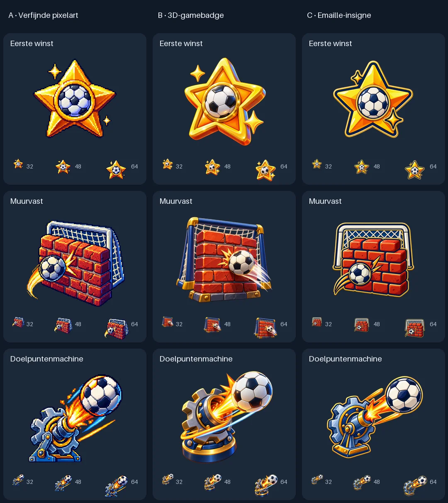

# Badges en iconen genereren

`scripts/generate_assets.py` is een losse beheer-CLI voor OpenAI Images. Hij
gebruikt dezelfde configuratienamen en Azure v1-authenticatie als de avatarservice,
maar verstuurt alleen de assetprompt. Er worden geen spelersfoto's, accounts of
wedstrijdgegevens gebruikt. De app en avatarworker hoeven niet te draaien.

De catalogus in `scripts/asset_catalog.json` bevat alle huidige assets,
hun betekenis, één gedeelde prompt en drie verwisselbare basisstijlen:

- `pixel`: A, verfijnde pixelart.
- `game3d`: B, een glanzende 3D-gamebadge.
- `enamel`: C, een geïllustreerd emaille-insigne.

Op 17 september 2026 is **B · 3D-gamebadge (`game3d`)** gekozen als standaard.
De prompts voor A (`pixel`) en C (`enamel`) blijven ongewijzigd in de catalogus
staan en zijn met `--style` beschikbaar voor nieuwe proeven. De oorspronkelijke proef vergelijkt
`first_win`, `muurvast` en `doelpuntenmachine` in elk van de drie stijlen:
negen afzonderlijke Images-aanroepen, één PNG per aanroep.



De frontend gebruikt B voor vier blijvende badges, tien records, de actieve
winreeksvlam en de voetbal op de groepenpagina, bij de cursor en bij het
klikeffect. De drie gekozen proefbeelden zijn hergebruikt; alleen de twaalf
ontbrekende onderwerpen zijn nieuw gegenereerd. Ook de kroon bij de huidige
nummer één gebruikt stijl B: `CrownIcon.vue` hergebruikt `dominant.webp` boven
avatars in de statistieken, op het speelveld en in de spelerskeuze. De positie
houdt rekening met het vierkante beeldformaat. Hiervoor is geen extra generatie
nodig. Het clubhuis op de startpagina gebruikt `clubhouse.webp` en opent de
clubstatistieken. Het beeld is een eenvoudige voetbalkeet met een laag dak,
één deur, één raam en een groot voetbalembleem voor herkenbaarheid op klein formaat.
Dit extra icoon is via dezelfde generator in stijl B gemaakt;
de volledige prompt en herkomst staan in de catalogus en het assetmanifest.
De overige SVG-interfaceiconen behouden hun eigen functie.

`grootste_choke` gebruikt een nerveuze voetbal met een grote zweetdruppel in
dezelfde stijl B. Het record gebruikt het hoogste verliespercentage bij 9–9:
10–9-verliespartijen gedeeld door alle 10–9-duels, met minimaal drie van die
duels per speler binnen de actieve filters. Beide spelers van een duo tellen
individueel mee. Gelijke percentages delen het record. De kaart toont alleen het percentage, bijvoorbeeld `80%`.
Het aantal verloren duels en het totaal per speler staan in de uitleg. Zonder spelers die aan de ondergrens voldoen,
verschijnt het record niet. Afstraffer toont de winnaar(s) en de uitslag; de uitleg noemt
expliciet wie van wie verloor. De korte uitleg verschijnt bij hover met de muis;
een muisklik zet de uitleg niet vast. Op een aanraakscherm opent of sluit een
tik op de recordkaart de uitleg. Scrollen sluit de uitleg direct, ook binnen
een scrollbaar paneel. Toetsenbordbediening blijft beschikbaar.

## Configuratie

Gebruik de bestaande backendomgeving; er zijn geen nieuwe dependencies:

```sh
uv sync --project backend
```

Azure gebruikt `AZURE_OPENAI_API_KEY`, `AZURE_OPENAI_ENDPOINT` en
`AZURE_OPENAI_IMAGE_DEPLOYMENT`. Stel deze lokaal in zoals voor de avatars.
De bestaande PNBallie-deployment heet `gpt-image-2`. De CLI wijzigt het model
nooit automatisch. Endpoint en deployment kunnen ook expliciet mee via
`--endpoint` en `--model`; geef API-sleutels uitsluitend via de omgeving mee.

De directe OpenAI API is beschikbaar via `--provider openai`, met
`OPENAI_API_KEY` en `OPENAI_IMAGE_MODEL`. Kies daarvoor zelf een beschikbaar
model dat transparante PNG-uitvoer ondersteunt. Ondersteuning kan verschillen
tussen Azure-deployments en directe OpenAI-modellen; er is geen automatische
fallback naar een ander model of een andere provider.

Een lokaal, genegeerd env-bestand kan met uv geladen worden:

```sh
uv run --project backend --env-file .env python scripts/generate_assets.py list
```

## Eerst vergelijken

De onderstaande opdrachten gaan uit van de drie ingestelde Azure-variabelen:

```sh
# Controleer de negen prompts en API-instellingen zonder een API-aanroep.
uv run --project backend python scripts/generate_assets.py preview --dry-run

# Genereer de negen varianten; deze map mag nog niet bestaan.
uv run --project backend python scripts/generate_assets.py preview \
  --output output/imagegen/badge-styles-v1
```

Standaard: 1024 × 1024, `quality=high`, PNG, echte transparantie, maximaal drie
gelijktijdige aanvragen. Met `--quality medium` of `--quality low` kun je zelf
een andere kwaliteit kiezen. `--concurrency 1` voert aanvragen achter elkaar uit.
Een andere set vergelijken kan met `preview --assets dominant rivalen football`.

Elke uitvoermap bevat:

- `index.html`: lokale galerij met wisselbare lichte/donkere achtergrond,
  32/48/96px-weergaven en de volledige prompts.
- `comparison.png`: overzicht met stijlen in kolommen en onderwerpen in rijen.
- `<asset>--<stijl>.png`: de originele modeluitvoer; het alfakanaal blijft intact.
- `<asset>--<stijl>.json`: prompt, model, instellingen, status, SHA-256,
  transparantiecontrole en gebruiksgegevens als de provider die teruggeeft.
- `run.json`: alle geplande aanvragen zonder API-sleutel.

Open `index.html` rechtstreeks in een browser. De galerij werkt offline.
De proefuitvoer is lokaal opgeslagen onder `output/imagegen/` en wordt door Git
genegeerd. De geselecteerde en geoptimaliseerde B-assets staan wel in Git, onder
`frontend/src/assets/game3d/`. Het bijbehorende `manifest.json` bevat per asset de
volledige daadwerkelijk gebruikte prompt, provider, model, kwaliteit, bronhash,
uitsnede en hash van de WebP-uitvoer. Daardoor blijft de herkomst ook zonder de
lokale proefmappen beschikbaar.

## Stijl kiezen en hergebruiken

De huidige standaard is vastgelegd met:

```sh
uv run --project backend python scripts/generate_assets.py select --style game3d

# Gebruikt daarna automatisch de vastgelegde stijl.
uv run --project backend python scripts/generate_assets.py generate \
  --assets dominant koningspaar football

# Of genereer alle zestien assets in de gekozen stijl.
uv run --project backend python scripts/generate_assets.py generate --all
```

Met `generate --style pixel --assets first_win` kun je de standaard voor één run
overschrijven. Zonder `--output` krijgt iedere run een unieke map onder
`output/imagegen/`. Prompts zijn herbruikbaar; generaties zijn niet deterministisch
en kunnen ondanks dezelfde stijlprompt onderling verschillen.

## Assets in de frontend opnemen

Exporteer een voltooide generatie zonder nieuwe API-aanroepen:

```sh
uv run --project backend python scripts/generate_assets.py export \
  --input output/imagegen/game3d-v1 \
  --output frontend/src/assets/game3d
```

`export` gebruikt de gekozen stijl en standaard alle zestien catalogusitems.
Met `--assets first_win` werk je alleen een expliciete selectie bij. De bron-PNG
moet compleet zijn en overeenkomen met de opgeslagen SHA-256. Alle geselecteerde
bronnen worden gecontroleerd voordat frontendbestanden worden geschreven. Een
export naar dezelfde stijlmap vernieuwt de geselecteerde bestanden en bewaart de
andere manifestitems; voor een andere stijl is een aparte map nodig.

De webexport verwijdert pixels met alpha lager dan 16, snijdt lege buitenruimte
weg en centreert het icoon met een maximale zichtbare zijde van 224 pixels op een
transparant canvas van 256 × 256. Wit binnen een voetbal blijft behouden. De
uitvoer is lossless WebP; de originele PNG wordt niet gewijzigd.

`frontend/src/gameAssets.ts` laat Vite de WebP-bestanden opnemen met een hash in
de bestandsnaam. `GameIcon.vue` verzorgt vaste afmetingen en toegankelijkheid:
decoratieve beelden hebben geen dubbele schermlezertekst, de actieve winreeks
heeft wel een label. Bij een ontbrekend of niet geladen badge-/recordbeeld blijft
de bestaande emoji beschikbaar als fallback. Voor toekomstige badges geeft de
API een stabiele `key`; voeg diezelfde sleutel aan de catalogus toe, genereer en
exporteer hem. Het backendcontract en de regels voor het verdienen veranderen
door een andere afbeelding niet.

## Lokaal bekijken

Start de backend en frontend zoals in de hoofd-README beschreven en open
`http://localhost:5173/stats`. Gebruik dezelfde hostnaam als `AUTH_APP_ORIGIN`,
anders weigert de backend terecht inloggen via een andere origin.

De bestaande lokale testkopie draait met `.local-test/run.py` en heeft al
wedstrijdgegevens. De lokale inloggegevens staan in `.local-test/login.txt`.
Open **Records → Toon alle 9** voor de recordiconen en **Spelers → Roman**
voor de verdiende badges. **Mijn profiel** gebruikt dezelfde badgecomponent.
**Groepen** en het scorebord gebruiken de nieuwe voetbal. Een badge verschijnt
alleen wanneer de bestaande wedstrijdhistorie hem daadwerkelijk heeft verdiend.

### Korte uitleg bij badges en records

`BadgeHelp.vue` toont een i-knop naast elke badge en elk record. Hover opent
de uitleg tijdelijk; klikken, tikken of activeren met het toetsenbord houdt
hem open. Nogmaals activeren, buiten de uitleg klikken, focus verplaatsen of
Escape sluit hem. De tekst gebruikt de beschrijving uit de statistieken-API,
inclusief eventuele minimumaantallen wedstrijden. Verdiende badges vermelden
dat ze behouden blijven; records tonen alleen hun korte beschrijving en voorwaarden.

### Vlammen achter spelers

`PlayerFlames.vue` hergebruikt `streak_flame.webp` als twee zacht bewegende
vlammen achter de avatar vanaf **vijf actuele overwinningen op rij**. Ze staan
compact naast elkaar en steken links en rechts een beetje uit. Dit geldt
op het veld, in de spelerkeuze, bij de statistiekavatars en op het eigen profiel.
Het effect volgt de speler bij een positiewissel en de vernieuwde statistieken
na het opslaan of verwijderen van een wedstrijd. Onder vijf verdwijnt het weer;
de historische badge voor vijf zeges activeert het effect niet.

De kroon van de huidige nummer één kan tegelijk zichtbaar zijn. De vlammen
onderscheppen geen klik- of sleepacties en staan stil bij `prefers-reduced-motion`.
Er staat geen los vlamicoon naast de naam; de vlammen achter de avatar tonen de winreeks.

## Nieuwe assets of stijlen

Voeg een item aan `assets` in de catalogus toe. Gebruik een stabiele sleutel
met kleine letters, cijfers, underscores of koppeltekens:

```json
"comeback": {
  "label": "Comeback",
  "emoji": "↩️",
  "kind": "badge",
  "description": "Terugkomen van een achterstand.",
  "prompt": "A football following one strong upward curved arrow, expressing a sporting comeback."
}
```

Daarna werkt `generate --assets comeback` met de gekozen basisstijl.
Dit voegt alleen een illustratie toe; een nieuwe verdienregel in de app moet
afzonderlijk worden geïmplementeerd.

Een stijl toevoegen kan op dezelfde manier in `styles`, met `label`, `prompt`
en `resample` (`nearest` voor pixelart, anders `lanczos`). De gedeelde prompt
bewaakt compositie, transparantie en kleine leesbaarheid. `--catalog pad.json`
maakt een onafhankelijke collectie mogelijk. Alle stijlen uit die catalogus
worden door `preview` meegenomen.

## Onderbroken of mislukte run

Voltooide resultaten worden nooit overschreven. Hervatten kan met exact
dezelfde opdracht plus `--resume`. Alleen resultaten waarvan prompt,
provider, model, kwaliteit en afbeeldingshash overeenkomen worden overgeslagen.
Nog niet gestarte bestanden worden gegenereerd.

Een mislukte of onderbroken aanvraag wordt niet automatisch opnieuw betaald:
de CLI weigert die combinatie in dezelfde map opnieuw te versturen. Controleer
eerst de status in het bijbehorende JSON-bestand. Start een bewuste nieuwe poging
in een nieuwe uitvoermap, eventueel met alleen de betreffende asset en stijl.
Ook een antwoord dat de PNG-/transparantiecontrole niet doorstaat blijft bewaard.

## Verificatie en API-documentatie

```sh
uv run --project backend ruff check --config backend/pyproject.toml \
  scripts/generate_assets.py backend/tests/test_asset_generation.py
uv run --project backend pytest backend/tests/test_asset_generation.py
make check
```

De tests gebruiken een nagebootste HTTP-provider, kosten geen API-aanroepen en
controleren authenticatie, endpointvalidatie, foutafhandeling zonder automatische
retries, echte transparantie, het behouden van eerder betaalde resultaten en de
webexport. Frontendtests controleren of alle zestien beelden beschikbaar zijn,
schermlezerlabels kloppen en de fallback herstelt bij het wisselen van asset.

[OpenAI Images-documentatie](https://developers.openai.com/api/docs/guides/image-generation)
beschrijft de Generations API en uitvoerinstellingen. Voor de bestaande
Azure-deployment volgt de CLI hetzelfde v1-contract als de avatarservice:
`/openai/v1/images/generations?api-version=preview`, authenticatie via `api-key`.
